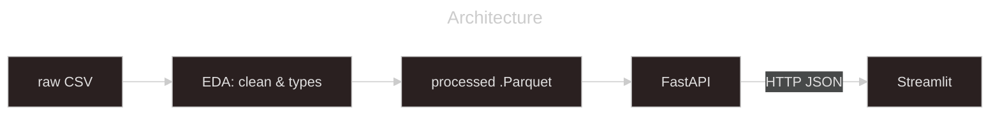

# eClipseBord Big Data & Cloud lab - Data Engineering DE25, STI Stockholm

A full-stack dashboard over NASA's solar and lunar eclipse catalogs (~24,000 records) built to run **three ways from one codebase** - locally, in Docker, and on Azure.
The application code never changes between them, a single environment variable does.

Fictional client **FastlyDep** (FastAPI + Streamlit + Deploy)

## Tech Stack
- **Backend:** FastAPI, Uvicorn, pandas, PyArrow
- **Frontend:** Streamlit, Plotly, httpx
- **Packaging:** uv workspace (one lockfile, two members), Python 3.13
- **Containers:** Docker, docker-compose
- **Cloud:** Azure Container Registry, Azure Container Apps, Terraform (IaC)

## Architecture
The same two processes run in every environment. The backend reads the data once at startup and
serves it over HTTP; the frontend owns no data and only asks the backend.



What changes between environments is *one* variable: `BACKEND_URL`, telling the frontend where the backend lives:

| Environment | `BACKEND_URL` | Set by |
|---|---|---|
| Local | *(unset)* -> `http://localhost:8000` | fallback in code |
| Docker | `http://backend:8000` | docker-compose service name |
| Azure | `https://<backend>.<region>.azurecontainerapps.io` | Terraform |


## Quickstart (local)
Requires [uv](https://docs.astral.sh/uv/) (it installs Python 3.13 for you if needed).

```bash
# Clone
git clone https://github.com/JohnnyHyytiainen/lab_azure_fullstack_DE25_johnny_hyytiainen.git
cd lab_azure_fullstack_DE25_johnny_hyytiainen

# Install everything (both members, one lockfile)
uv sync

# Terminal 1 - backend  -> http://localhost:8000  (docs at /docs)
uv run uvicorn backend.api:app --reload

# Terminal 2 - frontend -> http://localhost:8501
uv run streamlit run frontend/src/frontend/dashboard.py
```

## Docker & Azure
Running it as containers, deploying to Azure, and tearing it all down:
- **[Setup docs](docs/setup.md)** - Docker Compose, Azure deploy, teardown
- **[Troubleshooting docs](docs/troubleshooting.md)** - when something doesn't start


## Project Structure
```text
lab_azure_fullstack_DE25_johnny_hyytiainen/
├─ backend/
│  ├─ data/raw/            Raw data - SSOT
│  ├─ data/processed/      *.parquet - written by the EDA
│  └─ src/backend/         constants.py, data_processing.py, api.py
│
├─ frontend/
│  └─ src/frontend/        config.py, api_client.py, charts.py, dashboard.py
│
├─ EDA/                    eda.ipynb - cleans raw -> processed
├─ dockerfiles/            backend.dockerfile, frontend.dockerfile
├─ docker-compose.yaml     orchestrates the two images
├─ infra/                  Terraform - the whole Azure environment as code
├─ docs/                   setup & troubleshooting
├─ pyproject.toml          uv workspace root (members = backend, frontend)
└─ uv.lock                 one lockfile for the whole workspace
```

## Data
Two public NASA catalogs - solar and lunar eclipses, ~24,000 rows total. The raw CSVs are messy:
* coordinates as `6.0N` 
* durations as `06m37s`
* missing values as `-` 

A one-time EDA step cleans both into nine identically named, typed Parquet columns, so the backend reads them with one code path. Raw data is the source of truth and is never overwritten.

## License
[MIT](LICENSE)